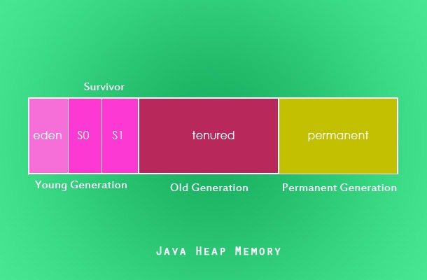

Java的内存管理实际上就是对象的管理，其中包括对象的分配和释放。对于程序员来说，分配对象使用new关键字；释放对象时，只要将对象所有引用赋值为null，让程序不能够再访问到这个对象，我们称该对象为“不可达的”。GC将负责回收所有“不可达”对象的内存空间。

堆内存以下三个主要区域：

1. 新生代（Young Generation）
  - Eden空间（Eden space，任何实例都通过Eden空间进入运行时内存区域）
  - S0 Survivor空间（S0 Survivor space，存在时间长的实例将会从Eden空间移动到S0 Survivor空间）
  - S1 Survivor空间 （存在时间更长的实例将会从S0 Survivor空间移动到S1 Survivor空间）
2. 老年代（Old Generation）实例将从S1提升到Tenured（终身代）
3. 永久代（Permanent Generation）包含类、方法等细节的元信息

## 启动Java垃圾回收

作为一个自动的过程，程序员不需要在代码中显示地启动垃圾回收过程。System.gc()和Runtime.gc()用来请求JVM启动垃圾回收。

虽然这个请求机制提供给程序员一个启动 GC 过程的机会，但是启动由 JVM负责。JVM可以拒绝这个请求，所以并不保证这些调用都将执行垃圾回收。启动时机的选择由JVM决定，并且取决于堆内存中Eden区是否可用。JVM将这个选择留给了Java规范的实现，不同实现具体使用的算法不尽相同。

毋庸置疑，我们知道垃圾回收过程是不能被强制执行的。我刚刚发现了一个调用System.gc()有意义的场景。通过这篇文章了解一下适合调用System.gc() 这种极端情况。

## Java垃圾回收过程

垃圾回收是一种回收无用内存空间并使其对未来实例可用的过程。

**Eden 区**：当一个实例被创建了，首先会被存储在堆内存年轻代的 Eden 区中。

注意：如果你不能理解这些词汇，我建议你阅读这篇 垃圾回收介绍 ，这篇教程详细地介绍了内存模型、JVM 架构以及这些术语。

**Survivor 区（S0 和 S1）**：作为年轻代 GC（Minor GC）周期的一部分，存活的对象（仍然被引用的）从 Eden 区被移动到 Survivor 区的 S0 中。类似的，垃圾回收器会扫描 S0 然后将存活的实例移动到 S1 中。

（译注：此处不应该是Eden和S0中存活的都移到S1么，为什么会先移到S0再从S0移到S1？）

死亡的实例（不再被引用）被标记为垃圾回收。根据垃圾回收器（有四种常用的垃圾回收器，将在下一教程中介绍它们）选择的不同，要么被标记的实例都会不停地从内存中移除，要么回收过程会在一个单独的进程中完成。

**老年代**： 老年代（Old or tenured generation）是堆内存中的第二块逻辑区。当垃圾回收器执行 Minor GC 周期时，在 S1 Survivor 区中的存活实例将会被晋升到老年代，而未被引用的对象被标记为回收。

**老年代 GC（Major GC）**：相对于 Java 垃圾回收过程，老年代是实例生命周期的最后阶段。Major GC 扫描老年代的垃圾回收过程。如果实例不再被引用，那么它们会被标记为回收，否则它们会继续留在老年代中。

**内存碎片**：一旦实例从堆内存中被删除，其位置就会变空并且可用于未来实例的分配。这些空出的空间将会使整个内存区域碎片化。为了实例的快速分配，需要进行碎片整理。基于垃圾回收器的不同选择，回收的内存区域要么被不停地被整理，要么在一个单独的GC进程中完成。

在释放一个实例和回收内存空间之前，Java 垃圾回收器会调用实例各自的 finalize() 方法，从而该实例有机会释放所持有的资源。虽然可以保证 finalize() 会在回收内存空间之前被调用，但是没有指定的顺序和时间。多个实例间的顺序是无法被预知，甚至可能会并行发生。程序不应该预先调整实例之间的顺序并使用 finalize() 方法回收资源。

 - 任何在 finalize过程中未被捕获的异常会自动被忽略，然后该实例的 finalize 过程被取消。
 - JVM 规范中并没有讨论关于弱引用的垃圾回收机制，也没有很明确的要求。具体的实现都由实现方决定。
 - 垃圾回收是由一个守护线程完成的。
