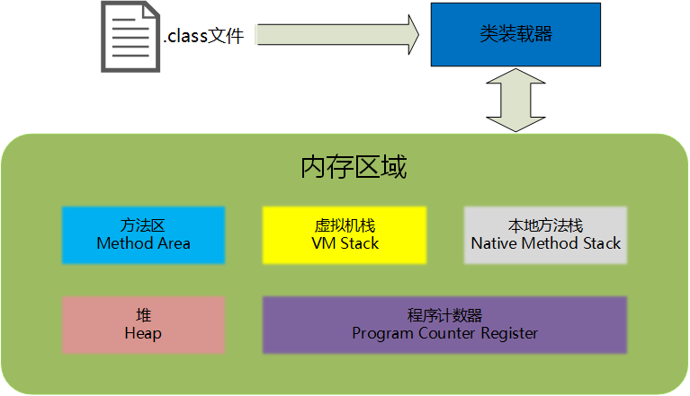
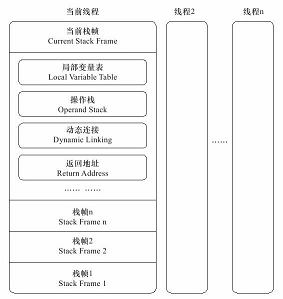

## JVM 简介
Java虚拟机（Java Virtual Machine 简称JVM）是运行所有Java程序的抽象计算机，是Java语言的运行环境，它是Java 最具吸引力的特性之一。Java虚拟机有自己完善的硬体架构，如处理器、堆栈、寄存器等，还具有相应的指令系统。JVM屏蔽了与具体操作系统平台相关的信息，使得Java程序只需生成在Java虚拟机上运行的目标代码（字节码），就可以在多种平台上不加修改地运行。

一个运行时的Java虚拟机实例的天职是：负责运行一个java程序。当启动一个Java程序时，一个虚拟机实例也就诞生了。当该程序关闭退出，这个虚拟机实例也就随之消亡。如果同一台计算机上同时运行三个Java程序，将得到三个Java虚拟机实例。每个Java程序都运行于它自己的Java虚拟机实例中。

## 内存区域
Java虚拟机在执行Java程序的过程中会把它管理的内存划分为若干个不同的内存区域。

从上图可以看到，根据存储数据的不同，Java内存通常被划分为5个区域：程序计数器（Program Count Register）、本地方法栈（Native Method Stack）、方法区（Methon Area）、虚拟机栈（VM Stack）、堆（Heap）。

### 程序计数器（Program Count Register）
又叫程序寄存器。JVM支持多个线程同时运行，当每一个新线程被创建时，它都将得到它自己的程序计数寄存器）。如果线程正在执行的是一个Java方法（非native），那么程序计数寄存器的值将总是指向下一条将被执行的指令，如果方法是 native的，程序计数器寄存器的值不会被定义。 JVM的程序计数寄存器的宽度足够保证可以持有一个返回地址或者native的指针。

由于JVM的多线程是通过线程轮流切换并分配处理器执行时间的方式来实现的，为了在线程切换后能恢复到正确的执行位置，每条线程都需要有一个独立的程序计数器，独立存储，互不影响。所以，程序计数器是线程私有的内存区域。

Java虚拟机规范中唯一一个没有规定任何OutOfMemoryError情况的区域。

### 栈（Stack）
没特别说明，栈指的是虚拟机栈（VM Stack）。JVM为每个新创建的线程都分配一个栈。也就是说,对于一个Java程序来说，它的运行就是通过对栈的操作来完成的。栈以帧为单位保存线程的状态。JVM对栈只进行两种操作：以帧为单位的压栈和出栈操作。我们知道,某个线程正在执行的方法称为此线程的当前方法。我们可能不知道，当前方法使用的帧称为当前帧。当线程激活一个Java方法，JVM就会在线程的虚拟机栈里新压入一个帧，这个帧自然成为了当前帧。在此方法执行期间，这个帧将用来保存参数、局部变量、中间计算过程和其他数据。从Java的这种分配机制来看,栈又可以这样理解：栈(Stack)是操作系统在建立某个进程时或者线程(在支持多线程的操作系统中是线程)为这个线程建立的存储区域，该区域具有先进后出的特性。

程序员主要关注的栈内存，就是虚拟机栈中局部变量表部分。局部变量表存放了编译时期可知的各种基本数据类型和对象引用。局部变量表所需的内存空间在编译时期完成分配，当进入一个方法时，这个方法需要在栈帧中分配多大的局部变量空间是完全确定的，在方法运行期间不会改变局部变量表的大小。

Java虚拟机规范对栈这个区域规定了两种异常情况：

 1. 如果线程请求的栈深度大于虚拟机所允许的深度，将抛出StackOverflowError 异常；
 2. 如果虚拟机栈可以动态扩展，如果扩展时无法申请到足够的内存，就会抛出OutOfMemoryError异常；（当前大部分JVM都可以动态扩展，只不过JVM规范也允许固定长度的虚拟机栈）

### 本地方法栈（Native Method Stack）
本地方法栈与虚拟机栈所发挥的作用是非常相似的，它们之间的区别不过是虚拟机栈为虚拟机执行Java方法服务（也就是字节码），而本地方法栈为虚拟机使用到的Native方法服务。

Java虚拟机规范对本地方法栈使用的语言、使用方法与数据结构并没有强制规定，因此可以由虚拟机自由实现。例如：HotSpot虚拟机直接将本地方法栈和虚拟机栈合二为一。

同虚拟机栈相同，Java虚拟机规范对这个区域也规定了两种异常情况StackOverflowError 和 OutOfMemoryError异常。

### 堆（Heap）
Java堆（Heap）是Java虚拟机所管理的内存中最大的一块。Java堆是被所有线程共享的一块内存区域。在此区域的唯一目的就是存放对象实例，几乎所有的对象实例都是在这里分配内存，但是这个对象的引用却是在栈（Stack）中分配。因此，执行`String s = new String("s")`时，需要从两个地方分配内存：在堆中为String对象分配内存，在栈中为引用（这个堆对象的内存地址，即指针）分配内存。

Java虚拟机规范规定，Java堆可以处于物理上不连续的内存空间中，只要逻辑上是连续的即可，就像我们的磁盘空间一样。在实现上，既可以是固定大小的，也可以是可扩展的，不过当前主流JVM都是按照可扩展来实现的。

Java虚拟机规范规定，如果在堆上没有内存完成实例分配，并且堆上也无法再扩展时，将会抛出OutOfMemoryError异常。

### 方法区（Method Area）
方法区也是被所有的线程共享的一块内存区域。它用于存储已被虚拟机加载的类信息、常量、静态变量、即时编译器编译后的代码等数据。

Java虚拟机规范对方法区的限制非常宽松，除了和Java堆一样 不需要连续的内存和可以选择固定大小或者可扩展之外，还可以选择不实现垃圾回收。这区域的内存回收目标主要是针对常量池的回收和类型的卸载，一般而言，这个区域的内存回收比较难以令人满意，尤其是类型的回收，条件相当苛刻，但是这部分区域的内存回收确实是必要的。Java虚拟机规范规定，当方法区无法满足内存分配的需求时，将抛出OutOfMemoryError异常。

运行时常量池是方法区的一部分。CLass文件中除了有类的版本、字段、方法、接口等描述信息外，还有一项信息是常量池，用于存放编译期生成的各种字面量和符号引用，这部分内容将在类加载后进入方法区的运行时常量池中存放。
运行时常量池相对于Class文件常量池的另外一个重要特征是具备动态性，Java语言并不要求常量一定只有编译期才能产生，也就是并非预置入Class文件中常量池的内容才能进入方法区运行时常量池，运行期间也可能将新的常量放入池中，这种特性被开发人员利用比较多的就是String类的intern()方法。

[Java内存分配和String类型的深度解析](https://my.oschina.net/xiaohui249/blog/170013)
